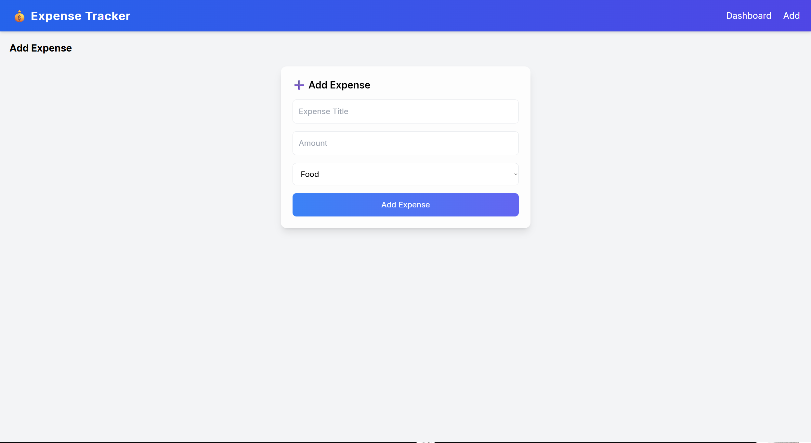

# 💰 Personal Finance Dashboard

A React-based web application to track, manage, and visualize personal expenses.

---

## 🚀 Features

* Add expenses with category
* Delete expenses
* Real-time dashboard updates
* Pie chart visualization (Chart.js)
* Clean UI using Tailwind CSS

---

## 🛠 Tech Stack

* React (Vite)
* Tailwind CSS
* Context API
* Chart.js

---

## 📸 Screenshots

### Dashboard


### Add Expense



---

## ▶️ Run Locally

```bash
npm install
npm run dev
```

---

## 🎯 Learning Outcomes

* React component structure
* State management using Context API
* CRUD operations
* Data visualization

---

## 👨‍💻 Author

Surya Rao
